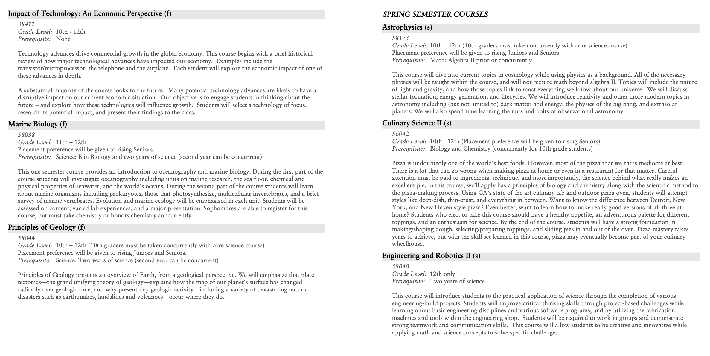

# Catalogators 
### By Patricia, Melina, Tara, and Elizabeth

## Problem
With a diverse range of over 200 possible courses to choose from, it can often be overwhelming for GA upper school students to choose which classes to take over their four years in high school. Due to the large volume of courses, students may be unaware of all the possible options they have, and thus miss out on taking an obscure class they would have thoroughly enjoyed.
GA's vast distribution of courses allows for each individual student to construct their own academic path; however, besides personal preferences, when it comes to sifting through possible courses to take the following year, each student must take into account whether they meet the requirements to take a certain class. For example, most courses require a student to have taken certain prerequisites (in order to take Astrophysics, the student must have taken Algebra II). Additionally, some courses are only offered for certain grade-levels (AP Economics and AP Psychology are only offered for seniors). Given these restrictions, a student may find it tedious to have to sift through all (~200) options to find which ones they fulfill the requirements for. This makes the course catalog a stressful maze to navigate for a student trying to construct their schedule for the following year.

## Solution
To help overwhelmed students choose appropriate classes for their next year, our team designed a program that takes in the grade the student is entering, as well as a file of courses the student has already taken/ is cuurently enrolled in, and based on those prerequisites, checks which classes the student is eligible to enroll in for their following year. From these possible courses, the program produces a possible schedule for the student by randomly choosing a class from each of the departments (Math, Science, English, Arts, History, and World Languages). The student can regenerate a new schedule as many times as they like based on their own personal preferences for which classes they would like to take. The program aims to offer a diverse list of possible classes individualized to each user based on the grade they are entering, and the classes they have already taken. Our program ensures that the student can be confident they fulfill the requirements for each course the program offers them, therefore eliminating the hassle of having to sift through the entire course catalog.

## Program Design
For our program design we have two main classes, the Course class and the ConstructSchedule class. The Course class creates course objects using object oriented programming containing instance variables of the courseName as a String, an arrayList of Strings of the grades that the course is available to, a String for the department that the course falls under and a Map of type Integer and String to denote the prequisites for each course. This class is essential to the foundation of our solution as these are the main objects that we are working with and eventually returning to our user as the courseName, because the objective is to create a potential schedule. The next class that we implemented was our ConstructSchedule class, which holds course objects and functions as our main runner class. In this class we have the instance variables of all of the courses in the universem, which are all of the potential classes the user can take, the selectedCourses and the past courses and the rising grade of the user. One of our main functions parseInput takes in the course catalogue as a file and creates course objects containing each of the necessary instance variables from the course class and stores this information. Additionally, we utitlize a randomization technique in our chooseSubject method to choose the subject that the user would like to randomly select for themselves depending on the available departments, such as art or history.

## Usage
Our intended users for this program are students entering into highschool at Greenwich Academy looking for advice and recommendation for course registration. The first file that would need to be uploaded to the program would be a course catalog, formatted in a CSV, containing the course names, the department type, the grades available to, and the prerequisites for each course. Next, the user would have to upload a transcript containing all of the classes that they have previously taken up to the current year that they are going into. For example, if the user is a rising junior they will upload a txt file containing all of the courses they have taken during freshmen and sophmore year in order to have the most accurate recommendations. Next, the user will use Java C to compile the ConstructSchedule class and input their transcript and course catalogue to the program. Then, the user should run the ConstructSchedule class using Java and the program will output a list of course object names of recommendations for the user that will be stored in a txt file called 'CoursesNextYear.txt' with all of the recommended courses to take for the next academic cycle. Because of the inheritance 'has-a' relationship between the ConstructSchedule and the Course class the user must ensure that both of the classes are kept in the same local repository on the machine.

